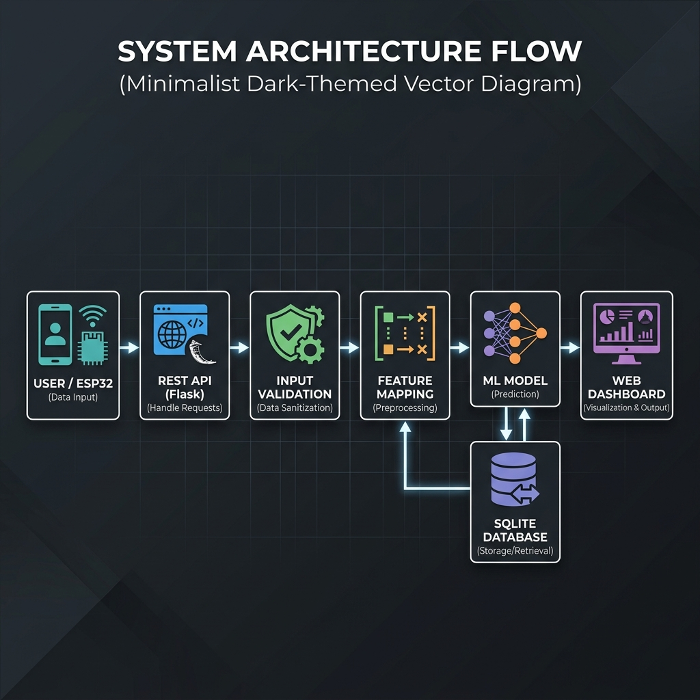
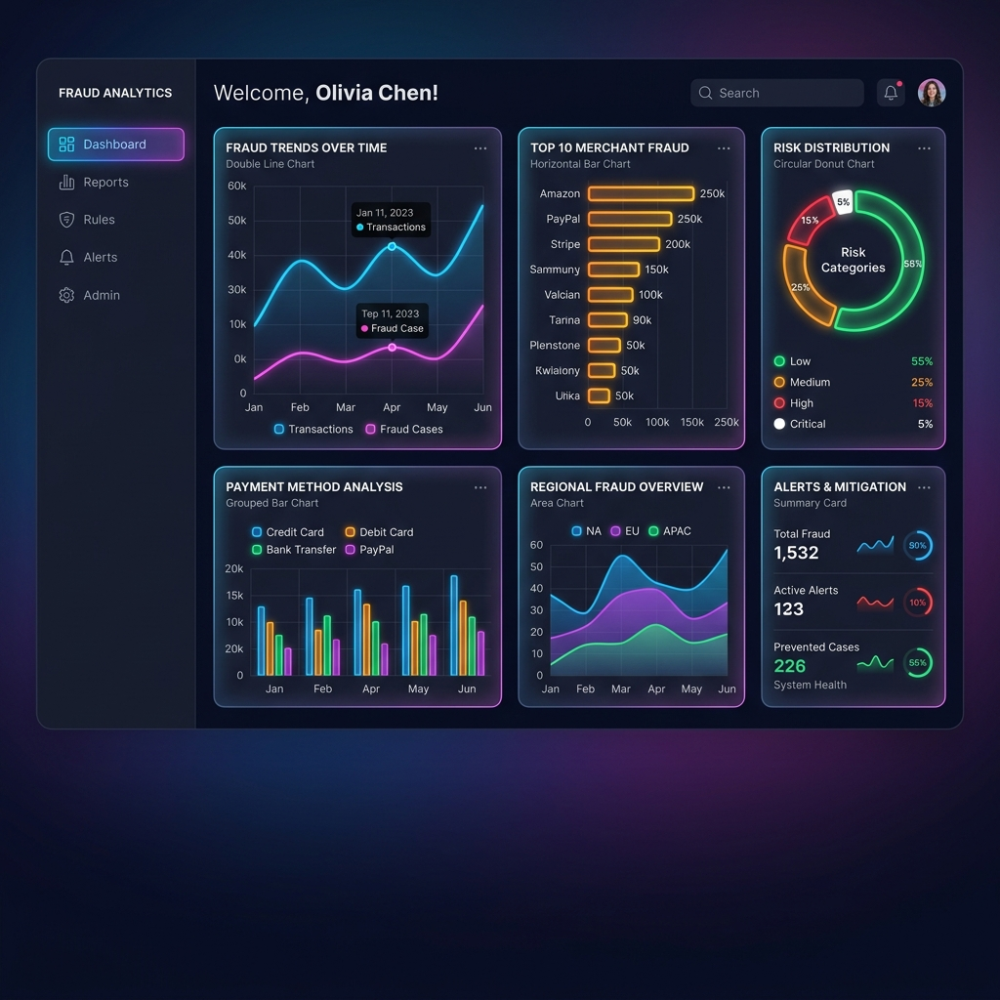
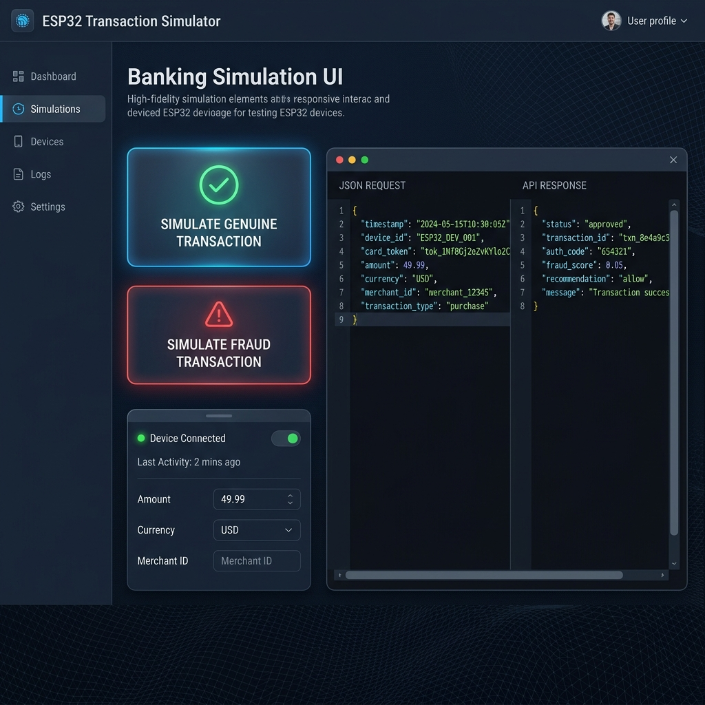

# IoT-Ready AI-Driven Credit Card Fraud Detection System


<div align="center">


</div>

---

The project has been developed as an IoT-ready AI-driven Credit Card Fraud Detection System featuring a modular software architecture. It integrates Machine Learning, REST APIs, SQLite, and a responsive web dashboard while preparing the platform for future ESP32-based IoT integration.

---

## 1. Project Objectives

* Detect fraudulent credit card transactions.
* Build a scalable Machine Learning system.
* Provide REST APIs for future IoT devices.
* Maintain transaction history.
* Visualize fraud analytics.
* Prepare the architecture for future ESP32 integration.

---

## 2. Technology Stack

* **Frontend**: HTML5, CSS3, Bootstrap 5, JavaScript, Chart.js.
* **Backend**: Python, Flask, REST APIs.
* **Machine Learning**: Scikit-learn, RandomForestClassifier, Pandas, NumPy.
* **Database**: SQLite.
* **Development Tools**: VS Code, Git / GitHub.
* **Future IoT Hardware**: ESP32, RFID RC522, Wi-Fi Module.

---

## 3. About the Dataset

### Context
It is important that credit card companies are able to recognize fraudulent credit card transactions so that customers are not charged for items that they did not purchase.

### Content
The dataset contains transactions made by credit cards in September 2013 by European cardholders. This dataset presents transactions that occurred in two days, where we have 492 frauds out of 284,807 transactions. The dataset is highly unbalanced, with the positive class (frauds) accounting for 0.172% of all transactions.

It contains only numerical input variables which are the result of a PCA transformation. Unfortunately, due to confidentiality issues, we cannot provide the original features and more background information about the data. Features V1, V2, … V28 are the principal components obtained with PCA. The only features which have not been transformed with PCA are 'Time' and 'Amount'. 
* **'Time'** contains the seconds elapsed between each transaction and the first transaction in the dataset.
* **'Amount'** is the transaction amount. This feature can be used for example-dependent cost-sensitive learning.
* **'Class'** is the response variable and it takes value 1 in case of fraud and 0 otherwise.

Given the class imbalance ratio, it is recommended to measure performance using the Area Under the Precision-Recall Curve (AUPRC).

### Acknowledgements
The dataset has been collected and analysed during a research collaboration of Worldline and the Machine Learning Group (http://mlg.ulb.ac.be) of ULB (Université Libre de Bruxelles).

---

## 4. System Architecture Overview



```text
User / ESP32
     │
     ▼
Transaction Data
     │
     ▼
REST API (Flask)
     │
     ▼
Input Validation
     │
     ▼
Feature Mapping (iot_feature_mapper.py)
     │
     ▼
Machine Learning Model (fraud_model.pkl)
     │
     ▼
Prediction Outcome ("Fraud" or "Genuine")
     │
     ▼
SQLite Database (transactions.db)
     │
     ▼
Dashboard & Analytics (Chart.js widgets)
```

Both the Web Interface (manual entry and simulation) and future ESP32 hardware communicate using the exact same REST API route: `POST /api/v1/predict`.

---

## 5. Key Features

### Implemented Features
* **AI-based Fraud Detection**: RandomForest classifier trained on Kaggle creditcard logs.
* **REST API Integration**: Standardised and versioned endpoints for model predictions, stats, and logs.
* **Real-time Dashboard**: Interactive UI summarizing transaction history.
* **Analytics Dashboard**: Comprehensive data views showing trend ratios and amount ranges.
* **Transaction Monitoring**: Log monitor tracking live transaction outputs.
* **SQLite Transaction Logging**: Persistent and parameterized ledger database.
* **IoT-ready Architecture**: Decoupled backend design welcoming future micro-controllers.
* **Modular Software Architecture**: Decoupled layers separating routes, services, models, database, and configurations.

### Simulated Features
* **ESP32 Simulation Console**: Trigger buttons to simulate card-terminal transactions locally.
* **Device Status Monitoring**: Simulated reader telemetry logs (WiFi connection, RSSI dBm, battery life).

### Future Enhancements
* **Live ESP32 Hardware Integration**: Connecting physical ESP32 boards with RFID reader modules.
* **Physical payment support**: RFID payment readers and NFC payment hardware.
* **Spatial & security checks**: GPS-based transaction validation and biometric verification (fingerprint/face recognition).
* **Alert notifications**: SMTP email and Twilio SMS warning notifications on fraudulent events.

---

## 6. Expected Output

* **Normal Transaction**:
  * Transaction accepted.
  * Stored in SQLite database.
  * Web Dashboard and Analytics charts updated.
  * Low risk score displayed.
* **Fraudulent Transaction**:
  * Fraud detected.
  * High risk score displayed.
  * Logged into database.
  * Future alert service triggered (alert logged in system logs).

---

## 7. Project Screenshots & Mockups

### Landing Page


### Login Page
 *Placeholder: Capture and place login screenshot here*

### Dashboard Overview


### Analytics Intelligence


### Transaction Monitor (Manual Log)
 *Placeholder: Capture and place monitor screenshot here*

### ESP32 Simulation Console


### ESP32 Device Status & Logs
 *Placeholder: Capture and place device status screenshot here*

---

## 8. Security Features

* **Input Validation**: Strictly validates types and bounds on all incoming parameters before prediction processing.
* **Server-side Validation**: Validates the presence of the model file and valid classification configurations before inference is triggered.
* **Secure Database Logging**: Uses parametrized queries in SQLite to completely prevent SQL injection vulnerabilities.
* **Role-Based Login**: Access controls limiting access to Admin and Analyst roles.
* **JWT/API-Key Ready**: Headers are validated, preparing the backend middleware for token authentication.
* **Error Handling**: Graceful error handlers return standard JSON response formats for malformed payloads.

---

## 9. System Requirements

* **Python**: 3.11+
* **System Memory**: 8 GB RAM
* **Operating System**: Windows / Linux / macOS
* **Browser**: Modern web browser (Chrome, Edge, Firefox, Safari)
* **Storage Engine**: SQLite (built-in)

---

## 10. How to Run the Project

### Step 1: Install dependencies
Navigate to the root directory and install requirements:
```bash
pip install -r requirements.txt
```

### Step 2: Place the dataset
Place the Kaggle Credit Card Fraud Detection dataset (`creditcard.csv`) inside the `datasets/` folder:
`datasets/creditcard.csv`

### Step 3: Train the model
Train the RandomForest model using:
```bash
python models/train_model.py
```
*Note: If the dataset file is missing, the script will exit gracefully without training.*

### Step 4: Run the application
Run the Flask server driver:
```bash
python backend/app.py
```

### Step 5: Open the browser
Navigate to:
`http://127.0.0.1:5000` (Local Development Server)

*Note: For production deployment, the application can be hosted on cloud platforms such as Render, Railway, or any Flask-compatible hosting service.*

---

## 11. Demo User Accounts

Access levels are restricted to the following demonstration roles:
* **Administrator** (Full credentials access for predictions and log writes)
* **Analyst** (Read-only access for dashboards and system monitoring)

*Default demonstration credentials are configurable through the application configuration and are intended only for academic testing.*

---

## 12. Example REST API Request

### Example IoT Transaction Payload:
* **HTTP Method**: `POST`
* **Path**: `/api/v1/predict`
* **Content-Type**: `application/json`

```json
{
  "card_id": "CARD1001",
  "amount": 2500,
  "merchant": "Amazon",
  "transaction_time": "14:35:20",
  "location": "Bangalore",
  "device_id": "ESP32-001",
  "transaction_type": "Online",
  "latitude": 12.9716,
  "longitude": 77.5946
}
```

### Example Response (Genuine):
```json
{
  "prediction": "Genuine",
  "risk_score": 0.08
}
```

### Example Response (Fraud):
```json
{
  "prediction": "Fraud",
  "risk_score": 0.94
}
```

---

## 13. Future Hardware Note

The current implementation provides a complete software prototype and an IoT-ready architecture. The backend, REST APIs, dashboard, and Machine Learning pipeline are fully prepared for future ESP32 integration.

When an ESP32 micro-controller is introduced in the future, it can communicate with the backend simply by sending transaction payloads to:
`POST /api/v1/predict`
without requiring any backend code changes. This demonstrates a scalable, decoupled IoT architecture.

---

## 14. Deployment Options

The Flask REST API and dashboard can be deployed to production using:
* **Render** / **Railway**: Simply link your GitHub repository, configure `python backend/app.py` as the entrypoint, and run.
* **Docker**: Build a Docker container using a standard python alpine base, exposing port `5000`.
* **Raspberry Pi**: Ideal for local network testing; run the server directly on the Raspberry Pi and connect the ESP32 to the Pi's IP address.
* **Cloud VMs** (AWS EC2, Google Cloud Compute): Set up python, bind to port `80/443`, and point ESP32 terminals to the public IP or domain.

---

## 15. Troubleshooting

* **API returns Model not trained error (503)**:
  Ensure `datasets/creditcard.csv` is present in the workspace, and run `python models/train_model.py` to compile `models/fraud_model.pkl`.
* **Database lock issues**:
  Restart the server application. SQLite connection factory functions automatically close connection handles to prevent write collisions.
* **Flask port 5000 in use**:
  Run the server on another port by modifying `app.run(port=5001)` in `backend/app.py`.

---

## 16. Conclusion

This project demonstrates an IoT-ready Machine Learning architecture for credit card fraud detection. The modular software design enables seamless integration with future ESP32 hardware while maintaining a scalable, secure, and extensible backend suitable for academic demonstrations and future enhancements.

---

## 17. License

Distributed under the MIT License. See `LICENSE` for more information.
